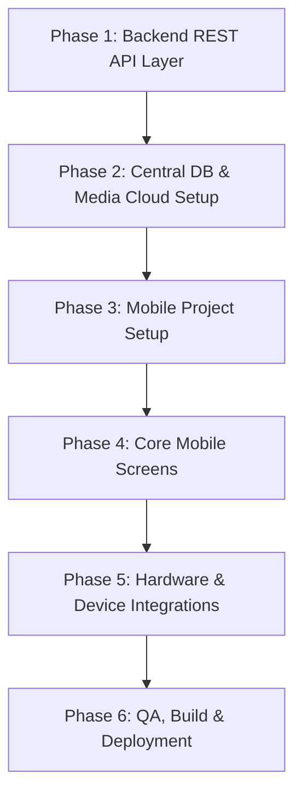

# Pawnshop Mobile & Web App Unified Roadmap (Approach 1)

> **Architecture:** Single Django Backend + Central Database powering both Counter Web App and Cross-Platform Mobile App (Android & iOS).

---

## 1. System Architecture Overview

```
                        ┌─────────────────────────────────────────┐
                        │   Central Cloud Database (PostgreSQL)   │
                        │     + Cloud Storage (AWS S3 / GCS)      │
                        └────────────────────┬────────────────────┘
                                             │
                        ┌────────────────────┴────────────────────┐
                        │     Django Core Backend (Python)        │
                        │ - Business Logic, Loan Calculations     │
                        │ - Accounting Ledger, GST, Security      │
                        │ - REST APIs (Django REST Framework)     │
                        └──────────┬───────────────────┬──────────┘
                                   │                   │
                     [HTML Views / Templates]    [REST API / JWT Auth]
                                   │                   │
                ┌──────────────────┴─────┐   ┌─────────┴────────────────┐
                │   Counter Web App      │   │   Cross-Platform Mobile  │
                │ (Desktop / Laptop)     │   │ (Flutter / React Native) │
                │                        │   │                          │
                │ • Heavy data entry     │   │ • Owner live dashboard   │
                │ • A4/Thermal printing  │   │ • Direct camera snap     │
                │ • Deep reporting & GST │   │ • On-the-go collection   │
                │ • End-of-day balances  │   │ • Bluetooth bill print   │
                └────────────────────────┘   └──────────────────────────┘
```

---

## 2. Current Project State & Readiness

Your project already has the foundational infrastructure configured:
- `djangorestframework` & `djangorestframework-simplejwt` are present in `pawnshop_management/settings.py`.
- Mature database models exist for **Loans**, **Customers**, **Branches**, **Transactions**, **Inventory**, and **Schemes**.
- Token and JWT authentication backends are already registered.

---

## 3. Step-by-Step Execution Plan



---

### Phase 1: Complete the Backend API Layer (DRF)

#### 1.1 API URL Structure
Register dedicated API routes under `pawnshop_management/urls.py`:
- `/api/v1/auth/login/` (JWT token obtain)
- `/api/v1/auth/refresh/` (JWT token refresh)
- `/api/v1/auth/me/` (Current user profile, role, and branch details)
- `/api/v1/dashboard/summary/` (Daily collection, disbursements, cash-in-hand, active loans)
- `/api/v1/customers/` (List, search, create, KYC document upload)
- `/api/v1/loans/` (Pledge list, filtering by status, search by loan number/customer phone)
- `/api/v1/loans/<id>/repay/` (Interest collection, principal repayment, loan closure)
- `/api/v1/schemes/` (Interest schemes and calculation rules)

#### 1.2 Serializers & Views to Implement
Create `serializers.py` and `api_views.py` across core apps:
- [loans/serializers.py](file:///d:/Hari_files/FirstMoneyGold/software_apps/pawnshop_v2/loans/): `LoanListSerializer`, `LoanCreateSerializer`, `LoanDetailSerializer`, `JewelItemSerializer`
- [accounts/serializers.py](file:///d:/Hari_files/FirstMoneyGold/software_apps/pawnshop_v2/accounts/): `UserSerializer`, `CustomerSerializer`
- [transactions/serializers.py](file:///d:/Hari_files/FirstMoneyGold/software_apps/pawnshop_v2/transactions/): `PaymentTransactionSerializer`, `CashSummarySerializer`

#### 1.3 Interactive API Documentation
Install `drf-spectacular` or `drf-yasg` to generate Swagger/OpenAPI documentation at `/api/docs/` so mobile developers can test endpoints directly.

---

### Phase 2: Central Database & Cloud Media Setup

1. **Migrate to PostgreSQL**:
   - Replace local `db.sqlite3` with managed PostgreSQL (e.g., Supabase, AWS RDS, GCP Cloud SQL, or Neon).
2. **Cloud Media Storage (S3 / GCP Bucket)**:
   - Configure `django-storages` with AWS S3 or Google Cloud Storage so gold item photos and customer ID cards uploaded via mobile are instantly accessible on the web app.
3. **CORS Configuration**:
   - Install and configure `django-cors-headers` to allow mobile client requests.

---

### Phase 3: Mobile App Project Setup

#### Recommended Tech Stack: **Flutter** *(or React Native / Expo)*
*Flutter is recommended for fast rendering, built-in camera controls, Bluetooth thermal printer libraries, and single codebase for Android & iOS.*

#### 3.1 Mobile Project Structure
```
pawnshop_mobile/
├── lib/
│   ├── api/             # HTTP Client (Dio) with JWT interceptors
│   ├── auth/            # Auth provider / token storage
│   ├── models/          # Data models (Loan, Customer, Payment, Jewel)
│   ├── screens/
│   │   ├── auth/        # Login, Branch Selection
│   │   ├── dashboard/   # Owner / Cashier Live KPI Metrics
│   │   ├── loans/       # Loan List, Loan Detail, New Pledge Wizard
│   │   ├── payments/    # Repayments, Interest Calculator
│   │   └── camera/      # Photo Capture for Jewels & KYC
│   ├── widgets/         # Reusable UI cards, badges, thermal print previews
│   └── main.dart
```

#### 3.2 Secure Token Storage & Auto-Refresh
- Use `flutter_secure_storage` / `expo-secure-store` to save JWT access & refresh tokens securely.
- Configure Axios / Dio interceptors to automatically refresh expired tokens without logging the user out.

---

### Phase 4: Core Mobile Features & Screens

#### 1. Live Owner / Manager Dashboard
- Real-time metrics: Today's Collection (₹), Loans Disbursed (₹), Interest Collected (₹), Net Cash in Drawer (₹).
- Active loan count & total pledged gold weight (Grams).
- Branch selector (for multi-branch owners).

#### 2. Fast Pledge / New Loan Creation Wizard
- **Step 1**: Search or add customer (phone number, address, KYC photo).
- **Step 2**: Enter gold items (item type, gross weight, net weight, purity/karat).
- **Step 3**: Take photo directly from mobile camera and attach to jewel item.
- **Step 4**: Select loan scheme (rate of interest, duration) and confirm disbursement.

#### 3. Quick Interest / Principal Repayment
- Search by Loan Number, Customer Name, or Phone Number.
- Barcode/QR Code scanning from existing loan receipts.
- Calculate exact interest due up to current date.
- Record payment (Cash / UPI / Bank Transfer) and update backend balance immediately.

---

### Phase 5: Hardware & Mobile-Specific Features

1. **Bluetooth Thermal Receipt Printing**:
   - Integrate `esc_pos_printer` / `blue_thermal_printer` to print compact 2-inch / 3-inch receipt slips directly from mobile for field collections or quick counter billing.
2. **Camera Integration & Auto-Compression**:
   - Automatically compress gold jewel images before upload to save bandwidth and storage.
3. **Push Notifications (Firebase Cloud Messaging - FCM)**:
   - Overdue interest alerts, daily summary reports sent to shop owner every evening.

---

### Phase 6: Testing & Deployment

1. **Backend Automated Tests**: Run Django test suites for all API endpoints to ensure calculations and transactions match the web app.
2. **Mobile Build**:
   - Generate release APK/AAB for Android devices.
   - iOS IPA build for iPad/iPhone (via TestFlight).

---

## 4. Immediate Next Steps (To-Do Checklist)

- [x] **Step 1:** Build the core authentication & profile API endpoints (`/api/v1/auth/login/`, `/api/v1/auth/refresh/`, `/api/v1/auth/me/`).
- [x] **Step 2:** Build the Dashboard KPI API (`/api/v1/dashboard/summary/`) returning daily collection, active loans, and cash status.
- [x] **Step 3:** Build the Loan & Payment APIs (`/api/v1/loans/`, `/api/v1/loans/<id>/repay/`, `/api/v1/payments/`).
- [x] **Step 4:** Set up the Interactive Swagger & OpenAPI documentation (`/api/docs/`).
- [x] **Step 5:** Initialize the Cross-Platform Mobile App (Flutter) project repository with Royal Gold theme.
- [x] **Step 6:** Install Flutter SDK (`C:\src\flutter`), resolve pub dependencies, and verify compilation.
- [x] **Step 7:** Create 1-Click Unified Web & Mobile Runner script (`run_web_and_mobile.bat` & `.ps1`).
